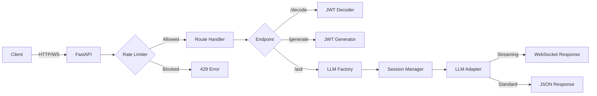

# 🔐 JWT Visualiser Backend

<div align="center">

[](https://fastapi.tiangolo.com/)
[](https://www.python.org/)
[](LICENSE)
[](https://python-poetry.org/)

**Production-ready FastAPI backend for JWT analysis, generation, and AI-powered security insights**

[Features](#-features) • [Quick Start](#-quick-start) • [API Documentation](#-api-documentation) • [Deployment](#-deployment) • [Contributing](#-contributing)

</div>

---

## 📖 Overview

The JWT Visualiser Backend is a high-performance, async FastAPI application that provides comprehensive JWT processing capabilities with AI-powered analysis. It supports multiple LLM providers (Gemini, OpenAI, Ollama), implements RAG (Retrieval-Augmented Generation) for contextual responses, and includes production-grade features like rate limiting, session management, and WebSocket support.

### Key Capabilities

- **JWT Operations**: Decode, validate, and generate JWTs with 14+ cryptographic algorithms
- **AI Integration**: Multi-provider LLM support with streaming responses
- **Rate Limiting**: IP-based and session-based request throttling to protect API quotas
- **RAG System**: Vector database powered knowledge retrieval using ChromaDB
- **Real-time Communication**: WebSocket support for streaming AI responses
- **Production Ready**: Comprehensive error handling, logging, and monitoring

---

## 🌟 Features

### Core Functionality

| Feature | Description | Status |
|---------|-------------|--------|
| **JWT Decoding** | Base64URL decoding with structure validation | ✅ Production |
| **JWT Generation** | Support for HS*, RS*, ES*, PS*, EdDSA algorithms | ✅ Production |
| **Security Analysis** | Automated vulnerability detection and recommendations | ✅ Production |
| **Claims Extraction** | Parse and explain standard & custom JWT claims | ✅ Production |

### AI & Intelligence

| Feature | Description | Status |
|---------|-------------|--------|
| **Multi-LLM Support** | Gemini, OpenAI, Ollama (local) | ✅ Production |
| **Streaming Responses** | Server-Sent Events & WebSocket streaming | ✅ Production |
| **Session Memory** | Conversation history with LangChain integration | ✅ Production |
| **RAG System** | ChromaDB vector store with embeddings | ✅ Production |
| **Q&A Learning** | Store successful interactions for future retrieval | ✅ Production |

### Production Features

| Feature | Description | Status |
|---------|-------------|--------|
| **Rate Limiting** | IP + Session + Global limits (10/15/45 req/day) | ✅ Production |
| **Auto Documentation** | Interactive Swagger UI & ReDoc | ✅ Production |
| **CORS Support** | Configurable cross-origin resource sharing | ✅ Production |
| **Health Checks** | Monitoring endpoints with detailed metrics | ✅ Production |
| **Error Handling** | Structured error responses with logging | ✅ Production |
| **Type Safety** | Pydantic models for validation | ✅ Production |

---

## 🏗️ Architecture

```
backend/
├── app/
│   ├── api/
│   │   ├── routes.py              # API endpoints (decode, generate, chat)
│   │   └── schemas.py             # Pydantic models & validation
│   │
│   ├── core/
│   │   └── config.py              # Settings & environment configuration
│   │
│   ├── jwt/
│   │   ├── analysis.py            # Security analysis & claims extraction
│   │   ├── decoder.py             # Safe JWT decoding
│   │   └── generator.py           # Token generation with multiple algorithms
│   │
│   ├── llm/
│   │   ├── base.py                # LLM provider interface
│   │   ├── factory.py             # Provider selection logic
│   │   ├── gemini_adapter.py      # Google Gemini integration
│   │   ├── openai_adapter.py      # OpenAI GPT integration
│   │   ├── ollama_adapter.py      # Local Ollama integration
│   │   ├── session_manager.py     # Conversation memory management
│   │   └── mock_adapter.py        # Testing mock
│   │
│   ├── middleware/
│   │   └── rate_limiter.py        # Rate limiting implementation
│   │
│   ├── vector/
│   │   ├── base.py                # Vector DB interface
│   │   ├── chroma_adapter.py      # ChromaDB implementation
│   │   └── qa_store.py            # Q&A knowledge store
│   │
│   └── main.py                    # FastAPI application & lifecycle
│
├── chroma_db/                     # Vector database storage (gitignored)
├── scripts/
│   ├── setup_ollama.py            # Ollama installation helper
│   ├── ingest_jwt_knowledge.py    # JWT knowledge ingestion script
│   └── manage_qa_history.py       # Q&A history management
├── pyproject.toml                 # Poetry dependencies
├── requirements.txt               # Pip dependencies (generated)
├── .env.example                   # Environment variables template
├── KNOWLEDGE_BASE_GUIDE.md        # Detailed RAG documentation
└── README.md                      # This file
```

### Request Flow



---

## 📦 Installation

### Prerequisites

- **Python**: 3.11 or higher
- **Poetry**: Recommended for dependency management
- **Ollama** (optional): For local LLM inference

### Using Poetry (Recommended)

```bash
# Install Poetry
curl -sSL https://install.python-poetry.org | python3 -

# Clone repository
git clone https://github.com/yourusername/jwt-visualiser.git
cd jwt-visualiser/backend

# Install dependencies
poetry install

# Activate virtual environment
poetry shell
```

### Using pip

```bash
# Create virtual environment
python3 -m venv venv
source venv/bin/activate  # Windows: venv\Scripts\activate

# Install dependencies
pip install -r requirements.txt
```

### Optional: Install Ollama (Local LLM)

```bash
# macOS/Linux
curl -fsSL https://ollama.com/install.sh | sh

# Pull recommended model
ollama pull phi3:3.8b
```

---

## ⚙️ Configuration

### Environment Variables

Create a `.env` file in the backend directory:

```bash
# ===================================
# LLM PROVIDER CONFIGURATION
# ===================================

# LLM Provider: "ollama" (local), "gemini", or "openai"
LLM_PROVIDER=gemini

# Use paid LLM services (true) or local Ollama (false)
USE_PAID_LLM=true

# ===================================
# API KEYS
# ===================================

# Google Gemini API Key (get from: https://makersuite.google.com/app/apikey)
GOOGLE_API_KEY=your_gemini_api_key_here

# OpenAI API Key (optional)
OPENAI_API_KEY=your_openai_api_key_here

# ===================================
# OLLAMA CONFIGURATION (Local LLM)
# ===================================

# Ollama Server URL
OLLAMA_HOST=http://localhost:11434

# Ollama Model (phi3:3.8b recommended for JWT analysis)
OLLAMA_MODEL=phi3:3.8b

# Max tokens to generate
OLLAMA_NUM_PREDICT=2048

# Response creativity (0.0-1.0)
OLLAMA_TEMPERATURE=0.3

# Context window size
OLLAMA_NUM_CTX=2048

# ===================================
# VECTOR DATABASE & RAG
# ===================================

# ChromaDB storage path
VECTOR_DB_PATH=./chroma_db

# Enable RAG (Retrieval-Augmented Generation)
ENABLE_RAG=true

# Store Q&A pairs for learning
ENABLE_QA_LEARNING=true

# ===================================
# CORS CONFIGURATION
# ===================================

# Allowed origins (comma-separated or "*" for all)
BACKEND_CORS_ORIGINS=*
```

### Configuration Options

#### LLM Provider Selection

| Environment | LLM_PROVIDER | USE_PAID_LLM | Best For |
|-------------|--------------|--------------|----------|
| **Local Development** | `ollama` | `false` | Privacy, no API costs |
| **Production (Low Traffic)** | `gemini` | `true` | Free tier, 50 req/day |
| **Production (High Traffic)** | `openai` | `true` | Enterprise, reliable |

#### Rate Limiting Configuration

Edit `app/middleware/rate_limiter.py` to adjust limits:

```python
RateLimiter(
    requests_per_ip_per_day=10,      # Per IP address
    requests_per_session_per_day=15,  # Per session
    global_requests_per_day=45        # Total across all users
)
```

---

## 🚀 Running the Application

### Development Mode

```bash
# Start server with hot-reload
poetry run uvicorn app.main:app --reload

# Or with custom host/port
poetry run uvicorn app.main:app --host 0.0.0.0 --port 8000 --reload
```

Server will start at: `http://localhost:8000`

### Production Mode

```bash
# Run with Gunicorn + Uvicorn workers
gunicorn app.main:app \
  --workers 4 \
  --worker-class uvicorn.workers.UvicornWorker \
  --bind 0.0.0.0:8000 \
  --timeout 120
```

### Docker

```bash
# Build image
docker build -t jwt-visualiser-backend .

# Run container
docker run -p 8000:8000 --env-file .env jwt-visualiser-backend
```

---

## 📚 Knowledge Base & RAG System

### Overview

The backend includes a production-ready **RAG (Retrieval-Augmented Generation)** system that ingests JWT documentation from authoritative sources and provides accurate, source-attributed responses.

### Features

- **Web Scraping**: Automatically fetches JWT specs from RFCs, OWASP, JWT.io
- **Source Tracking**: Every answer includes exact URLs and content previews
- **Smart Chunking**: Intelligently splits documents while preserving context
- **Deduplication**: Prevents repeated sources in responses
- **Q&A Learning**: Stores successful interactions for future reference
- **Confidence Scores**: Color-coded relevance indicators (High/Medium/Low)

### Ingestion Setup

#### 1. Enable RAG in .env

```bash
ENABLE_RAG=true
ENABLE_QA_LEARNING=true
VECTOR_DB_PATH=./chroma_db
```

#### 2. Install Dependencies

```bash
# Using Poetry
poetry install

# The following packages will be installed:
# - chromadb: Vector database
# - sentence-transformers: Local embeddings (no API costs)
# - beautifulsoup4: Web scraping
# - lxml: HTML/XML parsing
```

#### 3. Run Initial Ingestion

```bash
# Ingest JWT documentation from all default sources
poetry run python scripts/ingest_jwt_knowledge.py

# Expected output:
# ✅ Scraped 40 documents from 7 authoritative sources
# ✅ Created 1,304 chunks
# ✅ Success Rate: 100%
# ⏱️  Duration: ~2-5 minutes
```

#### 4. Add Custom Sources (Optional)

```bash
# Ingest additional URLs
poetry run python scripts/ingest_jwt_knowledge.py --custom-urls https://example.com/jwt-guide

# Dry run to check configuration
poetry run python scripts/ingest_jwt_knowledge.py --dry-run
```

### Default Sources

The system automatically ingests from:

| Source | Type | Priority | URL |
|--------|------|----------|-----|
| **RFC 7519** | Specification | Critical | [IETF](https://datatracker.ietf.org/doc/html/rfc7519) |
| **RFC 7515** | Specification | Critical | [JWS Spec](https://datatracker.ietf.org/doc/html/rfc7515) |
| **RFC 7516** | Specification | Critical | [JWE Spec](https://datatracker.ietf.org/doc/html/rfc7516) |
| **RFC 7517** | Specification | Critical | [JWK Spec](https://datatracker.ietf.org/doc/html/rfc7517) |
| **RFC 7518** | Specification | Critical | [JWA Spec](https://datatracker.ietf.org/doc/html/rfc7518) |
| **JWT.io** | Documentation | High | [Introduction](https://jwt.io/introduction) |
| **OWASP** | Security | High | [Cheat Sheet](https://cheatsheetseries.owasp.org/cheatsheets/JSON_Web_Token_for_Java_Cheat_Sheet.html) |

### Q&A History Management

#### View Statistics

```bash
# Check how many Q&A pairs are stored
poetry run python scripts/manage_qa_history.py --status

# Output:
# 📊 Q&A Collection Status:
#    Total Q&A Pairs: 42
#    Can Reference Past Answers: True
```

#### Clear Q&A History

```bash
# Delete all stored Q&A pairs
poetry run python scripts/manage_qa_history.py --clear

# Confirmation required:
# ⚠️  WARNING: This will delete ALL Q&A pairs!
# Type 'yes' to confirm: yes
# ✅ Successfully deleted jwt_qa_history collection
```

#### List Recent Q&A Pairs

```bash
# View last 10 Q&A pairs
poetry run python scripts/manage_qa_history.py --list

# View more pairs
poetry run python scripts/manage_qa_history.py --list --limit 20
```

### API Endpoints

#### Search Knowledge Base

```http
POST /api/v1/knowledge/search
Content-Type: application/json

{
  "query": "What is JWT?",
  "top_k": 5
}
```

**Response with Sources:**
```json
{
  "success": true,
  "results": [
    {
      "content": "Full content here...",
      "content_preview": "...exact snippet showing where info was taken...",
      "source": {
        "url": "https://datatracker.ietf.org/doc/html/rfc7519#section-1",
        "name": "RFC 7519 - JSON Web Token (JWT)",
        "type": "specification",
        "section": "Introduction",
        "section_id": "section-1",
        "priority": "critical"
      },
      "similarity_score": 0.8942
    }
  ]
}
```

#### Trigger Ingestion

```http
POST /api/v1/knowledge/ingest
Content-Type: application/json

{
  "custom_urls": ["https://example.com/jwt-guide"],
  "incremental": true
}
```

#### Get Knowledge Base Status

```http
GET /api/v1/knowledge/status
```

**Response:**
```json
{
  "success": true,
  "statistics": {
    "vector_database": {
      "collections": {
        "jwt_knowledge": {"count": 1304},
        "jwt_qa_history": {"count": 42}
      }
    },
    "rag_enabled": true,
    "qa_learning_enabled": true
  }
}
```

### Source Attribution in Responses

When RAG is enabled, all AI responses include:

1. **Numbered Source Cards** with:
   - Source name and type
   - Exact section and URL
   - Confidence score (High/Medium/Low)
   - Content preview showing exact text

2. **Click-to-Expand**:
   - Click any source to see full chunk content
   - Scrollable for long passages
   - Chevron indicators for expand/collapse

3. **Confidence Scoring**:
   - 🟢 **High** (0.70-1.00): Highly relevant
   - 🟡 **Medium** (0.40-0.69): Moderately relevant
   - 🟠 **Low** (0.00-0.39): Somewhat relevant
   - Poor matches (<0) automatically filtered

### Performance

- **Ingestion**: 2-5 minutes for default sources
- **Query Time**: <100ms for vector search
- **Storage**: ~50MB for 1,300 chunks with embeddings
- **Memory**: ~200MB at runtime (local embeddings)
- **No API Costs**: All embeddings run locally

### Troubleshooting

#### ChromaDB Telemetry Warnings

If you see telemetry warnings, they're harmless but can be disabled:

```python
# Already configured in app/vector/chroma_adapter.py
settings=ChromaSettings(
    anonymized_telemetry=False  # Disables telemetry
)
```

Restart the server for changes to take effect.

#### Low Relevance Scores

If sources seem irrelevant:
1. Check if ingestion completed successfully
2. Verify `ENABLE_RAG=true` in `.env`
3. Re-run ingestion to refresh data
4. Clear Q&A history if it contains outdated info

#### Missing Sources

```bash
# Verify vector database has data
poetry run python scripts/manage_qa_history.py --status

# Re-ingest if needed
poetry run python scripts/ingest_jwt_knowledge.py
```

### Advanced Configuration

```python
# app/vector/ingestion_service.py

JWTIngestionService(
    chunk_size=1000,        # Adjust for longer/shorter chunks
    chunk_overlap=200,      # Context preservation
    batch_size=50,          # Processing batch size
    max_retries=3           # Retry failed operations
)
```

For detailed documentation, see [KNOWLEDGE_BASE_GUIDE.md](./KNOWLEDGE_BASE_GUIDE.md).

---

## 📚 API Documentation

### Interactive Documentation

Once the server is running:

- **Swagger UI**: http://localhost:8000/docs
- **ReDoc**: http://localhost:8000/redoc
- **OpenAPI JSON**: http://localhost:8000/openapi.json

### Core Endpoints

#### JWT Decoding

```http
POST /api/v1/decode
Content-Type: application/json

{
  "token": "eyJhbGciOiJIUzI1NiIsInR5cCI6IkpXVCJ9..."
}
```

**Response:**
```json
{
  "success": true,
  "header": {
    "alg": "HS256",
    "typ": "JWT"
  },
  "payload": {
    "sub": "1234567890",
    "name": "John Doe",
    "iat": 1516239022
  },
  "signature": "SflKxwRJSMeKKF2QT4fwpMeJf36POk6yJV_adQssw5c",
  "analysis": {
    "header_explanation": "...",
    "claims_explanation": [...]
  }
}
```

#### JWT Generation

```http
POST /api/v1/generate
Content-Type: application/json

{
  "payload": {
    "sub": "user123",
    "name": "Jane Doe",
    "role": "admin"
  },
  "algorithm": "HS256",
  "secret": "your-256-bit-secret",
  "expires_in_minutes": 60
}
```

**Supported Algorithms:**
- `HS256`, `HS384`, `HS512` (HMAC)
- `RS256`, `RS384`, `RS512` (RSA)
- `ES256`, `ES384`, `ES512` (ECDSA)
- `PS256`, `PS384`, `PS512` (RSA-PSS)
- `EdDSA` (Ed25519)

#### AI Chat (WebSocket)

```javascript
const ws = new WebSocket('ws://localhost:8000/api/v1/ask/ws');

ws.onopen = () => {
  ws.send(JSON.stringify({
    type: 'ask',
    token: 'your.jwt.token',
    question: 'What security issues does this token have?'
  }));
};

ws.onmessage = (event) => {
  const data = JSON.parse(event.data);
  console.log(data.type); // 'chunk', 'complete', 'rate_limit', 'error'
};
```

#### Health & Monitoring

```http
GET /health
```

**Response:**
```json
{
  "status": "healthy",
  "llm_provider": "gemini",
  "rag_enabled": false,
  "active_sessions": 3,
  "rate_limit_stats": {
    "total_ips_tracked": 15,
    "global_requests_today": 42,
    "global_limit": 45,
    "reset_in_seconds": 18420
  }
}
```

---

## 🛡️ Rate Limiting

### How It Works

The backend implements a **three-tier rate limiting** strategy:

1. **Per IP Address**: 10 requests/day
2. **Per Session**: 15 requests/day
3. **Global Limit**: 45 requests/day (protects free-tier API quota)

### Rate Limit Response

When exceeded:

```json
{
  "error": "Rate limit exceeded",
  "message": "You have reached your daily limit of 10 requests. Please try again tomorrow.",
  "requests_made": 10,
  "requests_limit": 10,
  "retry_after": 43200,
  "limit_type": "ip"
}
```

### Monitoring

```bash
# Check rate limit statistics
curl http://localhost:8000/api/v1/rate-limit/stats
```

### Customization

To adjust limits for your use case, edit `app/middleware/rate_limiter.py`:

```python
rate_limiter = RateLimiter(
    requests_per_ip_per_day=20,      # Increase IP limit
    requests_per_session_per_day=30,  # Increase session limit
    global_requests_per_day=100       # Increase global limit
)
```

---

## 🧪 Testing

### Run Tests

```bash
# Run all tests
poetry run pytest

# With coverage
poetry run pytest --cov=app --cov-report=html

# Specific test file
poetry run pytest tests/test_decoder.py -v
```

### Test Structure

```
tests/
├── test_decoder.py       # JWT decoding tests
├── test_generator.py     # JWT generation tests
├── test_rate_limiter.py  # Rate limiting tests
└── test_api.py           # API endpoint tests
```

---

## 🚢 Deployment

### Render.com

1. **Create Web Service**:
   - Connect your GitHub repository
   - Select `backend` as root directory

2. **Configure Build**:
   ```bash
   # Build Command
   pip install -r requirements.txt

   # Start Command
   gunicorn app.main:app --workers 4 --worker-class uvicorn.workers.UvicornWorker --bind 0.0.0.0:$PORT
   ```

3. **Environment Variables**:
   ```
   LLM_PROVIDER=gemini
   USE_PAID_LLM=true
   GOOGLE_API_KEY=<your-api-key>
   ```

### Railway.app

1. **Connect Repository**
2. **Add Environment Variables**
3. Railway auto-detects Python and runs:
   ```bash
   uvicorn app.main:app --host 0.0.0.0 --port $PORT
   ```

### Fly.io

```bash
# Install flyctl
curl -L https://fly.io/install.sh | sh

# Launch app
fly launch

# Deploy
fly deploy

# Set secrets
fly secrets set GOOGLE_API_KEY=your-key
```

### Docker Compose

```yaml
version: '3.8'

services:
  backend:
    build: ./backend
    ports:
      - "8000:8000"
    environment:
      - LLM_PROVIDER=gemini
      - USE_PAID_LLM=true
      - GOOGLE_API_KEY=${GOOGLE_API_KEY}
    volumes:
      - ./chroma_db:/app/chroma_db
    restart: unless-stopped
```

---

## 🔧 Development

### Code Style

```bash
# Format code
poetry run black app/

# Sort imports
poetry run isort app/

# Lint
poetry run flake8 app/

# Type checking
poetry run mypy app/
```

### Adding a New Endpoint

```python
# app/api/routes.py

@router.post("/my-endpoint")
async def my_endpoint(request: Request, data: MySchema):
    """
    Endpoint description.
    """
    rate_limiter = get_rate_limiter()
    await rate_limiter.check_rate_limit(request)
    
    # Your logic here
    return {"success": True, "data": result}
```

### Adding a New LLM Provider

1. Create adapter in `app/llm/`:
```python
# app/llm/my_provider_adapter.py

from app.llm.base import LLMProvider

class MyProviderAdapter(LLMProvider):
    async def generate_response(self, prompt: str, context: dict) -> str:
        # Implementation
        pass
    
    async def generate_response_stream(self, prompt: str, context: dict):
        # Streaming implementation
        pass
```

2. Register in factory:
```python
# app/llm/factory.py

from app.llm.my_provider_adapter import MyProviderAdapter

class LLMFactory:
    @staticmethod
    def get_provider() -> LLMProvider:
        if settings.LLM_PROVIDER == "myprovider":
            return MyProviderAdapter(api_key=settings.MY_PROVIDER_KEY)
        # ...
```

---

## 📊 Monitoring & Logging

### Application Logs

```python
import logging

logger = logging.getLogger(__name__)
logger.info("Processing request")
logger.error("Error occurred", exc_info=True)
```

### Metrics Endpoints

```bash
# Health check with metrics
GET /health

# Rate limiter statistics
GET /api/v1/rate-limit/stats

# Active sessions count
GET /api/v1/sessions/info
```

### Production Monitoring

**Recommended Tools:**
- **Sentry**: Error tracking
- **DataDog**: APM & logging
- **Prometheus**: Metrics collection
- **Grafana**: Visualization

---

## 🐛 Troubleshooting

### Common Issues

#### Issue: `ModuleNotFoundError: No module named 'app'`

**Solution:**
```bash
# Ensure you're in backend directory
cd backend

# Reinstall dependencies
poetry install
```

#### Issue: Ollama connection failed

**Solution:**
```bash
# Check if Ollama is running
ollama list

# Start Ollama service
ollama serve

# Verify model is downloaded
ollama pull phi3:3.8b
```

#### Issue: Rate limit errors in development

**Solution:**
```python
# Temporarily disable rate limiting in development
# app/middleware/rate_limiter.py

rate_limiter = RateLimiter(
    requests_per_ip_per_day=1000,  # High limit for dev
    # ...
)
```

#### Issue: CORS errors

**Solution:**
```python
# .env
BACKEND_CORS_ORIGINS=http://localhost:3000,https://yourdomain.com

# Or allow all (development only)
BACKEND_CORS_ORIGINS=*
```

---

## 📚 Additional Resources

- [FastAPI Documentation](https://fastapi.tiangolo.com/)
- [Pydantic Models](https://docs.pydantic.dev/)
- [JWT.io](https://jwt.io/) - JWT Debugger
- [RFC 7519](https://datatracker.ietf.org/doc/html/rfc7519) - JWT Specification
- [LangChain Documentation](https://python.langchain.com/)
- [ChromaDB Documentation](https://docs.trychroma.com/)

---

## 🤝 Contributing

We welcome contributions! Please see the main [CONTRIBUTING.md](../CONTRIBUTING.md) for guidelines.

### Quick Contribution Guide

1. Fork the repository
2. Create a feature branch: `git checkout -b feature/amazing-feature`
3. Make your changes
4. Add tests
5. Run linters: `poetry run black app/ && poetry run flake8 app/`
6. Commit: `git commit -m 'Add amazing feature'`
7. Push: `git push origin feature/amazing-feature`
8. Open a Pull Request

---

## 📄 License

This project is licensed under the MIT License - see the [LICENSE](../LICENSE) file for details.

---

## 📧 Support

- **Email**: dhanush.atwork@gmail.com
- **GitHub Issues**: [Report a bug](https://github.com/yourusername/jwt-visualiser/issues)
- **Documentation**: [Full Docs](https://docs.yourproject.com)

---

## 🙏 Acknowledgments

- **FastAPI** team for the excellent framework
- **JWT.io** for inspiration
- **Ollama** for making local LLMs accessible
- **ChromaDB** for vector database capabilities
- **LangChain** for LLM orchestration

---

<div align="center">

**Built with ❤️ using FastAPI, Python, and AI**

[⬆ Back to Top](#-jwt-visualiser-backend)

</div>
